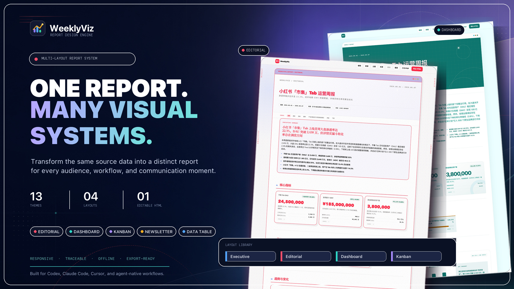

[中文](README.zh-CN.md) | [English](README.md) | 日本語 | [한국어](README.ko.md) | [Español](README.es.md) | [Português](README.pt.md) | [Français](README.fr.md)

<p align="center">
  
</p>

<h1 align="center">WeeklyViz</h1>

<p align="center">
  <strong>プロフェッショナルオフラインHTML週報ジェネレーター＆エージェントスキル</strong>
</p>

<p align="center">
  <a href=""></a>
  <a href="LICENSE"></a>
  <a href=""></a>
</p>

<p align="center">
  生の更新データ、スプレッドシート、ドキュメントを、<strong>プロフェッショナルでレスポンシブ、編集可能、ソース追跡可能なオフラインHTML週報</strong>にAIエージェントが自動で変換します。
</p>

[Agent Skills](https://agentskills.io) 仕様に基づいて構築された Claude スキルおよびスタンドアロンツールです。AIエージェント（Claude Code、Cursor、Codexなど）とシームレスに連携するように設計されています。Pythonスクリプトを実行したりコードを書く代わりに、このスキルをインストールするだけで、AIエージェントがすべての面倒な作業を自動で行います。

---

## 🖼️ 出力例

<p align="center">
  <a href="assets/weeklyviz-multi-layout-showcase.jpg">
    
  </a>
</p>

<p align="center"><sub>同じ業務データから、エディトリアルレポート、経営ダッシュボード、Kanban形式の進捗、データテーブルなど、複数のプロフェッショナルなレイアウトを生成できます。すべてレスポンシブ、編集可能、追跡可能、オフライン対応です。</sub></p>

---

## ✨ 主な機能

| 機能 | 説明 |
|------|------|
| 📊 **マルチソース抽出** | `.xlsx`、`.csv`、`.docx`、`.md`、`.txt` ファイルを自動的に解析し、指標データや進捗状況を抽出します。 |
| 🎨 **マルチレイアウトデザインシステム** | 13種類のプロフェッショナルテーマと、エディトリアル、経営ダッシュボード、Kanban、データ重視の複数レイアウトを搭載し、オフラインで動作します。 |
| 🔗 **ソース追跡可能性** | ハッシュ ID を使用して、すべての指標やリスト項目を元のファイル名と行に自動でマッピングし、追跡可能です。 |
| ✏️ **インライン編集** | 出力された HTML は完全にインタラクティブです。テキストや数値をインライン編集し、テーマ色を調整し、PDF/印刷に書き出せます。 |
| 📈 **ECharts 統合** | ローカルの ECharts ランタイム (`echarts.min.js`) を同梱し、オフライン環境で折れ線、棒、ドーナツなどのグラフを描画します。 |

---

## 🚀 使い方（とても簡単）

### 1. スキルのインストール
エージェントのスキルフォルダに WeeklyViz を追加します：

*   **Claude Code**：プロジェクトルートの `.claude/skills/weeklyviz` にこのリポジトリをクローンします。
*   **Cursor**：プロジェクトルートの `.cursor/skills/weeklyviz` にこのリポジトリをクローンします。
*   **その他のエージェント**：カスタム指示ファイルのパスにこのリポジトリを配置します。

### 2. エージェントに依頼するだけ！
Pythonコマンドの実行や構成ファイルの作成は**不要**です。生のファイル（スプレッドシート、メモ、テキスト貼付など）をAIエージェントに渡し、以下のように指示してください：

> *「WeeklyVizを使用して、私のメモから週報を生成してください。」*

エージェントが自動的にファイルを読み込み、指標を抽出し、検証を行って、精美なオフラインHTML週報（`weekly-report.html`）をワンショットで生成します。

---

## 🛠️ 開発者向け（オプション）

コマンドラインから手動で WeeklyViz を実行する場合：

```bash
# 生データをソースバンドルに抽出
python3 scripts/weeklyviz.py extract --input notes.md data.xlsx --output source-bundle.json

# 報告モデルのスキーマ検証
python3 scripts/weeklyviz.py validate --report report-model.json

# 自己完結型 HTML にコンパイル
python3 scripts/weeklyviz.py render --report report-model.json --output weekly-report.html
```

---

## 📋 リリースバージョン

*   **v0.1.1** (2026-06-09)
    - エージェントの標準的な読み込みとインストールのために、ディレクトリ階層をルートフォルダにフラット化。
    - `Editorial` テンプレートのプレミアムアップグレード（ドット背景、macOSスタイルのウィンドウバー、ハードシャドウ、ドット付き指標リスト、ダブルサイドバー装飾の追加）。
    - 公開リポジトリへのコミットを防ぐため、内部機密データを Git 追跡から完全に除外する安全ポリシーの策定。
*   **v0.1.0** (2026-06-09)
    - 初回リリース。
