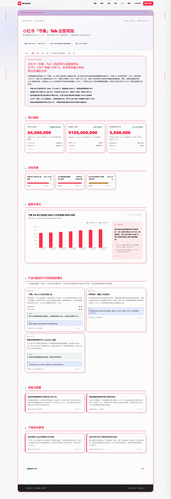

[中文](README.zh-CN.md) | [English](README.md) | [日本語](README.ja.md) | [한국어](README.ko.md) | [Español](README.es.md) | Português | [Français](README.fr.md)

<p align="center">
  
</p>

<h1 align="center">WeeklyViz</h1>

<p align="center">
  <strong>Gerador Profissional de Relatórios Semanais HTML Offline e Skill de Agente</strong>
</p>

<p align="center">
  <a href=""></a>
  <a href="LICENSE"></a>
  <a href=""></a>
</p>

<p align="center">
  Converta atualizações de texto, planilhas e documentos em <strong>relatórios semanais HTML offline profissionais, responsivos, editáveis e com rastreabilidade de origem</strong>.
</p>

É uma Claude Skill e ferramenta independente construída sob a especificação [Agent Skills](https://agentskills.io). Combina a extração estruturada de dados com um sistema de design de nível editorial para transformar textos de trabalho, KPIs e gráficos em boletins executivos refinados. Projetado para ajudar desenvolvedores, gerentes de produto e operações a eliminar relatórios manuais bagunçados de copiar/colar e entregar relatórios visuais de alto impacto.

---

## 🖼️ Exemplo de Resultado

<p align="center">
  <a href="assets/red-shiji-weekly-report.jpg">
    
  </a>
</p>

<p align="center"><sub>Um relatório editorial completo gerado com o WeeklyViz: resumo executivo, cartões de KPI, progresso de metas, visualizações, atualizações de projetos, riscos e próximas ações. Clique na imagem para vê-la na resolução original.</sub></p>

---

## ✨ Recursos Principais

| Recurso | Descrição |
|---------|-----------|
| 📊 **Extração de Várias Fontes** | Processa arquivos `.xlsx`, `.csv`, `.docx`, `.md`, `.markdown` e `.txt` automaticamente para extrair métricas, tabelas, prosa e listas de progresso. |
| 🛡️ **Validação de Esquema Estrita** | Garante a conformidade do JSON Schema (`report.schema.json`) validando tipos de dados, séries cronológicas, proporções e rótulos antes da renderização. |
| 🎨 **Design Editorial Responsivo** | Oferece três temas embutidos (`Executive`, `Editorial`, `Product Operations`) com layouts responsivos e sem requisições de rede externas (100% offline). |
| 🔗 **Rastreabilidade de Origem** | Mapeia automaticamente cada KPI, barra de progresso, gráfico e item de volta ao arquivo e linha originais usando IDs hash estáveis. |
| ✏️ **Edição Inline Interativa** | O relatório HTML final suporta edição de textos e números em tempo real, ajustes de tema e exportação simples para PDF/impressão. |
| 📈 **Apache ECharts Integrado** | Inclui runtime local do ECharts (`echarts.min.js`) para criar gráficos de linhas, barras, roscas, funis e cascatas sem acesso à internet. |
| 🔍 **Validador de Acessibilidade** | Acompanha script de verificação de acessibilidade e estrutura HTML (`validate_html.mjs`) para testar o comportamento offline e navegação por teclado. |

---

## 🚀 Início Rápido

### 1. Instalar a Skill

<details>
<summary><b>Claude Code</b></summary>

Coloque a pasta `weeklyviz/` dentro de `.claude/skills/` na raiz do seu projeto:

```bash
git clone https://github.com/woodfantasy/WeeklyViz.git .claude/skills/weeklyviz
```
</details>

<details>
<summary><b>Cursor</b></summary>

Coloque a pasta `weeklyviz/` dentro de `.cursor/skills/` na raiz do seu projeto:

```bash
git clone https://github.com/woodfantasy/WeeklyViz.git .cursor/skills/weeklyviz
```
</details>

### 2. Fluxo de Trabalho

#### Passo 1: Extrair os Dados
```bash
python3 scripts/weeklyviz.py extract \
  --input path/to/metrics.xlsx path/to/updates.md \
  --output source-bundle.json
```

#### Passo 2: Escrever o Modelo
Crie o arquivo `report-model.json` de acordo com a estrutura definida em [report.schema.json](references/report.schema.json).

#### Passo 3: Validar e Compilar
```bash
# Validar dados e regras dos gráficos
python3 scripts/weeklyviz.py validate --report report-model.json

# Renderizar HTML
python3 scripts/weeklyviz.py render --report report-model.json --output weekly-report.html

# Verificar acessibilidade
node scripts/validate_html.mjs weekly-report.html
```

---

## 📋 Versões de Lançamento

*   **v0.1.1** (2026-06-09)
    - Estrutura de diretórios aplanada na pasta raiz para instalação e execução padrão do agente.
    - Design e atualização premium do modelo `Editorial` com fundos pontilhados, barra de estilo macOS, sombras sólidas deslocadas, listas de tópicos e barras laterais.
    - Política de segurança para excluir dados locais sensíveis do Shiji no repositório público do GitHub.
*   **v0.1.0** (2026-06-09)
    - Lançamento inicial.
    - Extrator de dados para CSV, XLSX, DOCX, MD e texto sem formatação.
    - Verificador de dados JSON Schema e regras rígidas para ECharts.
    - Compilação offline para relatório HTML interativo autocontido.
